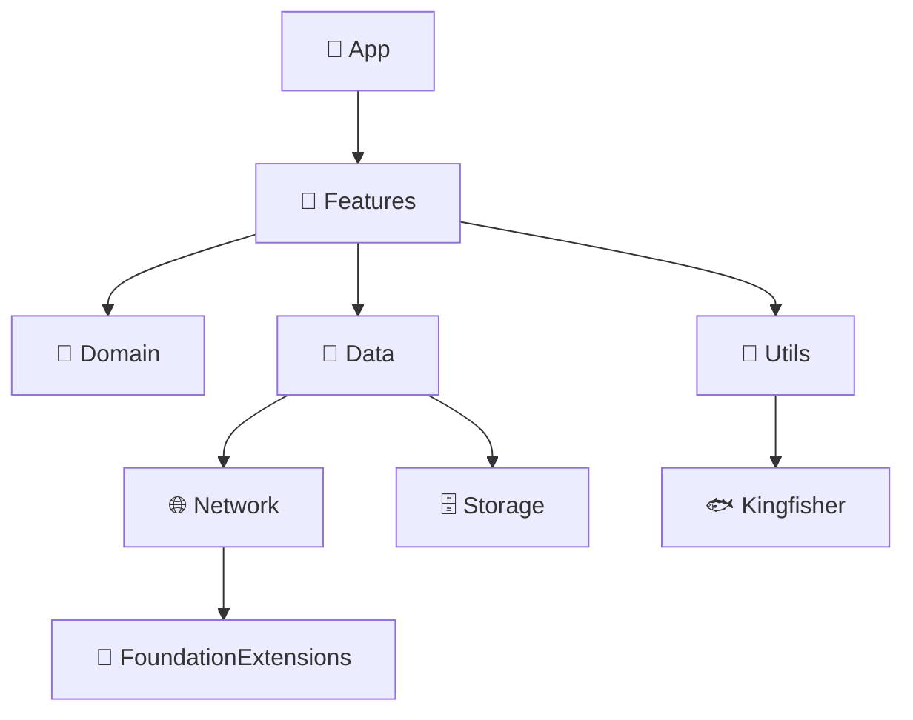

# 🎬 MovieApp 🍿

A clean-architecture, modular iOS app to browse, search, and save your favorite TMDB movies.

---

## ✨ Introduction ✨

Welcome to **MovieApp**! An iOS application built with Swift 6.0, Xcode 16.2, and modern **async/await** concurrency. Browse popular titles, search the TMDB catalog, and keep a personalized watch list—all in one sleek experience.

## 🏛 Architecture Overview 🏛

MovieApp is organized into independent Swift Package modules, each with a single responsibility:

* **App** 🚀: Entry point—initializes the root `UINavigationController` and invokes the **Features** module’s `FeatureCoordinator` to kick off navigation. Each feature module still defines its own coordinator to handle its internal flows.
* **Features** 🎨: Module grouping concept—each flow is represented by a named feature module, allowing you to add any new feature by name before full implementation. UI layer built with **UIKit** (rather than SwiftUI) for iOS 14 support and mature API access. By this modular concept, you can also add a separate feature module built with SwiftUI (for iOS 16.0+), and it will integrate seamlessly.

  * Includes two main flows:
  * **MoviesList**: Popular movies, search, and watch-list actions.
  * **MovieDetails**: Movie info, similar titles, and cast/crew.
* **Domain** 📖: Business rules, entities, use cases, and protocols.
* **Data** 💾: Implements domain protocols, TMDB API calls, and local persistence.
* **Network** 🌐: HTTP client & endpoint definitions.
* **Storage** 🗄️: Core Data stack wrapper for persistent storage.

  * Hosts the `WatchListStack` built on top of this wrapper.
  * Contains data model files (`.xcdatamodeld`) to keep persistence schemas organized.
* **FoundationExtensions** 🔧: Extensions on the Foundation SDK—JSON encoding, `DateFormatter` helpers, error utilities, and more—placed together for consistency.
* **Utils** 📱: UI helpers (e.g., `UIImageView+Kingfisher`).

## 📊 Dependency Graph



## 🛠️ Installation & Build 🛠️

1. Clone the repo.
2. Open `MovieApp.xcodeproj` in **Xcode 16.2** or newer (Swift 6.0).
3. Provide your TMDB API **Read Access Token** in `MoviesDBNetworkConfig.swift` (under `Data/Sources/...`).
4. Build & run on iOS 14+ simulator or device—enjoy Swift’s modern **async/await** concurrency!

## 🚀 Usage 🚀

In your App/Scene delegate, kick off the flow:

```swift
let nav = UINavigationController()
let coordinator = FeatureCoordinator(navigationController: nav)
coordinator.start()
window.rootViewController = nav
```

## 📦 Core Services & Features 📦

* **MovieRepositoryProtocol**:

  * `getPopularMovies`, `searchMovies`, `getMovieDetails`, `getSimilarMovies`, `getMovieCredits`.
* **WatchListLocalRepositoryProtocol**:

  * `addMovieToWatchList`, `removeMovieFromWatchList`, `getWatchListMovies`, `isMovieInWatchList`.
* **Movie Details** view: details, similar titles, and cast/crew.

## 🗝️ Key Principles 🗝️

* **Extensibility** 🔄: Swap or add features independently.
* **Modularity** 🧩: Each layer/package has clear boundaries.
* **Concurrency** ⚡️: Powered by Swift’s async/await.

## 📅 Roadmap / TODO 📅

* **🔒 Authentication Module**:

  * TMDB login flow: obtain account code & access token.
  * Real-time watch-list sync with TMDB account.

## 🤝 Contributing 🤝

I welcome contributions! Fork, branch, and send a PR. 💌
